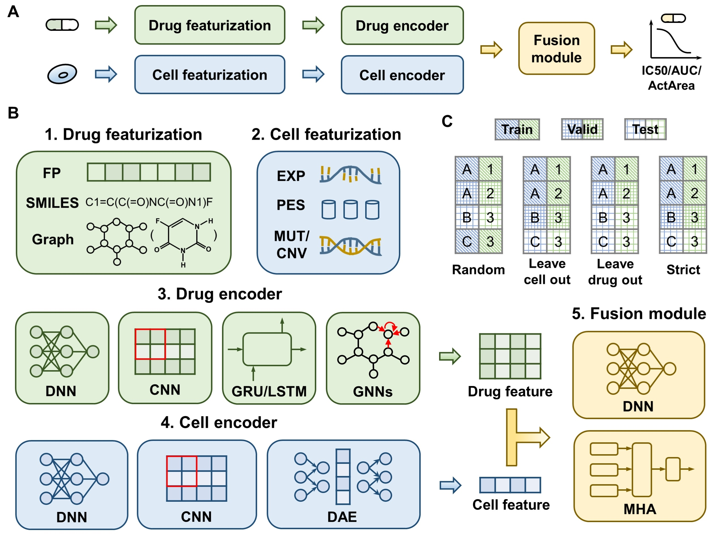

Welcome to DeepDR's documentation!
==================================

.. toctree::
   :glob:
   :maxdepth: 1
   :caption: Backgrounds

DeepDR simplifies the process by automating drug and cell featurization, model construction, training, and inference, all achievable with brief programming. The library incorporates three types of drug features along with nine drug encoders, four types of cell features along with nine cell encoders, and two fusion modules, enabling the implementation of up to 135 DL models for drug response prediction.
The Github repository is located `here <https://github.com/user15632/DeepDR>`_. The overview is as follows:

Overview of DeepDR library. **A** The drug and cell are processed through featurization and encoder, and then the drug response is decoded using the fusion module. **B** DeepDR provides drug and cell featurization, encoder, and fusion module. **C** DeepDR provides splitting methods, including random split, leave-cell-out split, leave-drug-out split, and strict split.

.. toctree::
   :glob:
   :maxdepth: 1
   :caption: Tutorials

   document/Install
   document/Tutorials0
   document/Tutorials1
   document/Tutorials2

.. toctree::
   :glob:
   :maxdepth: 1
   :caption: Package Reference

   document/Data
   document/Model
   document/CellEncoder
   document/DrugEncoder
   document/FusionModule
